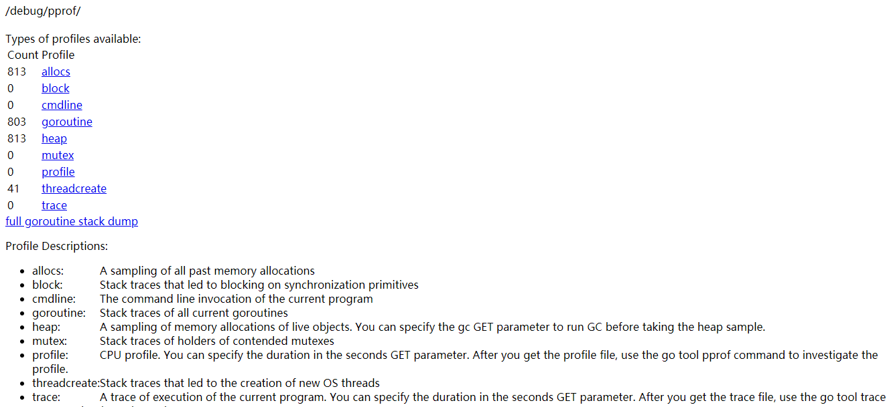
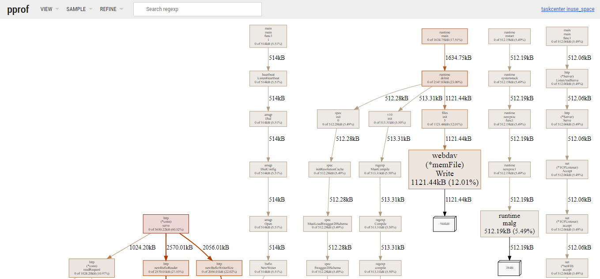

## 1. 前言

近段时间，发现开发的服务，启动的时候只有30MB左右，但是跑了几天后，居然高达400MB。在业务代码又比较复杂的情况下，琢磨者研究了一下这款工具，找到了程序内存升高的原因。

## 2. 简介

Go 语言自带的 pprof 库就可以分析程序的运行情况，并且提供可视化的功能。它包含两个相关的库。

- `runtime/pprof`

对于只跑一次的程序，例如每天只跑一次的离线预处理程序，调用 pprof 包提供的函数，手动开启性能数据采集。

- `net/http/pprof`

对于在线服务，对于一个 HTTP Server，访问 pprof 提供的 HTTP 接口，获得性能数据。当然，实际上这里底层也是调用的 runtime/pprof 提供的函数，封装成接口对外提供网络访问。

另外，除了这两种方法，也可通过`go test -bench . -cpuprofile prof.cpu`生成采样文件，程序进行针对性优化。

## 3. 实践

这里由于自己开发的程序基于`gin`框架，gin中已经集成了pprof，我们直接通过以下几行代码添加即可。

```go
package main

import (
	"github.com/gin-contrib/pprof" // 1. add gin pprof
    ...
)

func main(){
    router, err := handler.NewRouter()
	if err != nil {
		logger.Fatal(err)
	}
	pprof.Register(router) // 2. register pprof router
	...
}
```

启动程序，通过服务端口即可访问 pprof 的数据

查看当前总览：访问 `http://$IP:$PORT/debug/pprof`



```
cpu（CPU Profiling）: /debug/pprof/profile，默认进行 30s 的 CPU Profiling，得到一个分析用的 profile 文件
block（Block Profiling）：/debug/pprof/block，查看导致阻塞同步的堆栈跟踪
goroutine：/debug/pprof/goroutine，查看当前所有运行的 goroutines 堆栈跟踪
heap（Memory Profiling）: /debug/pprof/heap，查看活动对象的内存分配情况
mutex（Mutex Profiling）：/debug/pprof/mutex，查看导致互斥锁的竞争持有者的堆栈跟踪
threadcreate：/debug/pprof/threadcreate，查看创建新 OS 线程的堆栈跟踪
```

我这里使用终端工具对分析结果进行图形化展示

```bash
go tool pprof -http=:8081 http://$IP:$PORT/debug/pprof/heap
```



里面包含程序内存分析的 dot 格式的图、火焰图、top 列表、source 列表等。

待续..

